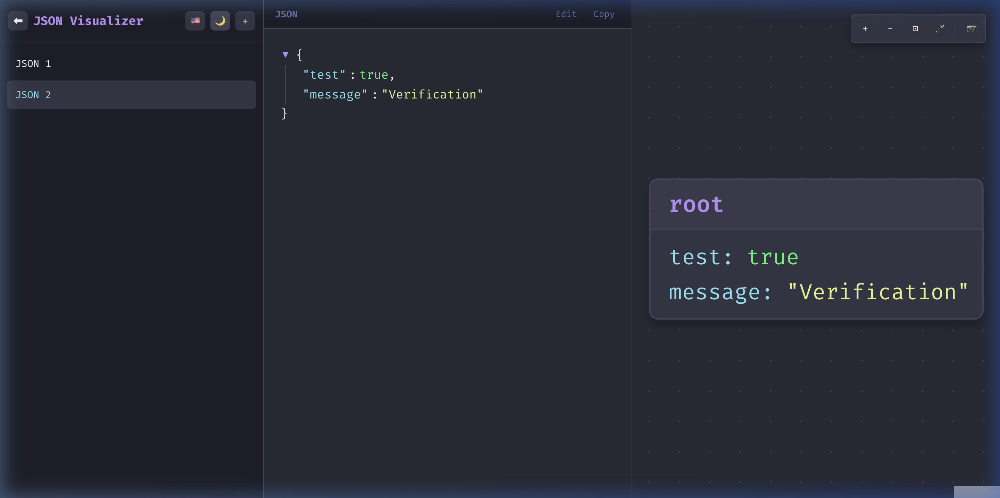
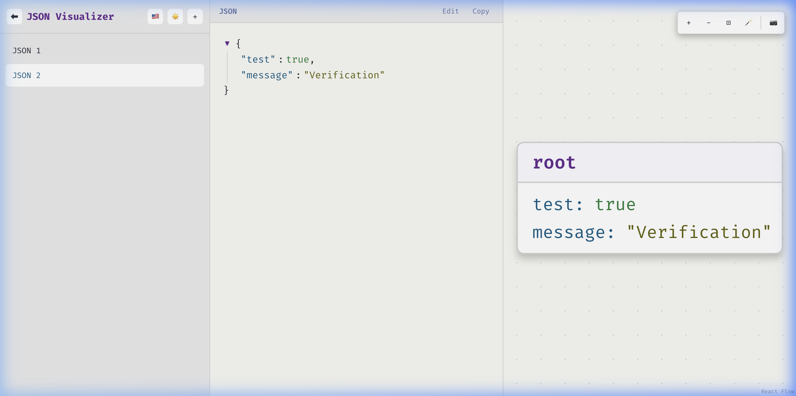

<p align="center">
  
</p>

<h1 align="center">JSON Visualizer</h1>

<p align="center">
  <strong>A minimalist web app to visualize, format, and explore JSON data as interactive node diagrams.</strong>
</p>

<p align="center">
  <a href="https://matheusvmg.github.io/json-visualizer/">Live Demo</a> •
  <a href="#features">Features</a> •
  <a href="#getting-started">Getting Started</a> •
  <a href="#tech-stack">Tech Stack</a>
</p>

<p align="center">
  
  
  
  
  
</p>

---

## 📸 Preview

| Dark Mode (Dracula) | Light Mode |
|---|---|
|  |  |

---

## ✨ Features

- **🔎 JSON Input** — Paste JSON directly or drag-and-drop `.json` files
- **📝 Syntax Highlighting** — Beautiful code view with Dracula-themed highlighting via [highlight.js](https://highlightjs.org/)
- **🗺️ Interactive Diagram** — Node-based visual representation of JSON structure powered by [React Flow](https://reactflow.dev/)
- **🔄 Collapsible Nodes** — Expand and collapse nested objects/arrays in the diagram
- **✏️ Inline Editing** — Edit JSON directly in the editor panel with live diagram updates
- **📋 One-Click Copy** — Copy formatted JSON to clipboard instantly
- **📁 Unlimited Tabs** — Work with multiple JSONs side by side with a tabbed interface
- **🎨 Dark & Light Themes** — Toggle between Dracula dark mode and a clean light theme
- **🌐 i18n** — Full bilingual support (English 🇺🇸 & Português 🇧🇷)
- **📥 PNG Export** — Download the diagram as a high-resolution PNG image
- **🔧 Diagram Controls** — Zoom in/out, fit-to-view, rearrange layout, and pan
- **🧲 Collapsible Sidebar** — Maximize workspace by collapsing the sidebar
- **💾 Local Persistence** — Tabs, JSON data, theme, and language preferences are saved to `localStorage`
- **🚫 No Backend** — Runs 100% client-side. Your data never leaves your browser.

---

## 🚀 Getting Started

### Prerequisites

- [Node.js](https://nodejs.org/) ≥ 18
- npm ≥ 9

### Installation

```bash
# Clone the repository
git clone https://github.com/matheusvmg/json-visualizer.git
cd json-visualizer

# Install dependencies
npm install

# Start development server
npm run dev
```

The app will be available at `http://localhost:5173/json-visualizer/`.

### Build for Production

```bash
npm run build
```

The production bundle will be output to the `dist/` directory.

---

## 🏗️ Tech Stack

| Category | Technology |
|---|---|
| **Framework** | [React 19](https://react.dev/) |
| **Language** | [TypeScript 5.9](https://www.typescriptlang.org/) |
| **Bundler** | [Vite 8](https://vite.dev/) |
| **Diagram Engine** | [React Flow 11](https://reactflow.dev/) |
| **Graph Layout** | [Dagre](https://github.com/dagrejs/dagre) |
| **Syntax Highlighting** | [highlight.js](https://highlightjs.org/) |
| **Image Export** | [html-to-image](https://github.com/niconi21/html-to-image) |
| **Compiler** | [React Compiler](https://react.dev/learn/react-compiler) + Babel |
| **Deployment** | [GitHub Pages](https://pages.github.com/) (via GitHub Actions) |

---

## 📂 Project Structure

```
json-visualizer/
├── public/                   # Static assets (favicon, icons)
├── src/
│   ├── components/
│   │   ├── Diagram/          # React Flow diagram panel & nodes
│   │   ├── Editor/           # JSON editor with syntax highlighting
│   │   ├── InputPanel/       # JSON input (paste / drag-and-drop)
│   │   ├── Sidebar/          # Tab management sidebar
│   │   └── Toolbar/          # Diagram control toolbar
│   ├── context/
│   │   └── I18nContext.tsx    # Internationalization (EN / PT-BR)
│   ├── hooks/
│   │   ├── useI18n.ts        # i18n hook
│   │   ├── useJsonParser.ts  # JSON parsing & validation
│   │   ├── useTabs.ts        # Tab state management
│   │   └── useTheme.ts       # Theme toggle (dark/light)
│   ├── styles/
│   │   ├── global.css        # Design tokens & global styles
│   │   └── components.css    # Component-specific styles
│   ├── utils/
│   │   ├── exportDiagram.ts  # PNG export logic
│   │   └── storage.ts        # localStorage abstraction
│   ├── App.tsx               # Main application component
│   └── main.tsx              # Entry point
├── docs/                     # PRD & implementation docs
├── .github/workflows/        # CI/CD (GitHub Pages deploy)
├── vite.config.ts            # Vite configuration
├── tsconfig.json             # TypeScript configuration
└── package.json
```

---

## 🎨 Design

The application uses the **Dracula** color palette as its primary theme:

| Token | Color | Usage |
|---|---|---|
| `--bg` | `#282a36` | Background |
| `--purple` | `#bd93f9` | Numbers, accents |
| `--cyan` | `#8be9fd` | Keys, attributes |
| `--green` | `#50fa7b` | Bullets, success |
| `--pink` | `#ff79c6` | Keywords |
| `--yellow` | `#f1fa8c` | Strings |
| `--orange` | `#ffb86c` | Literals |
| `--red` | `#ff5555` | Errors |

**Fonts:**
- **Code:** `Fira Code` / `JetBrains Mono`
- **UI:** `Fira Code` / `Inter`

---

## 🌐 Deployment

The project is automatically deployed to **GitHub Pages** on every push to the `main` branch via a [GitHub Actions workflow](.github/workflows/deploy.yml).

**Live URL:** [https://matheusvmg.github.io/json-visualizer/](https://matheusvmg.github.io/json-visualizer/)

---

## 📄 License

This project is open source and available under the [MIT License](LICENSE).

---

<p align="center">
  Made with 💜 by <a href="https://github.com/matheusvmg">matheusvmg</a>
</p>
